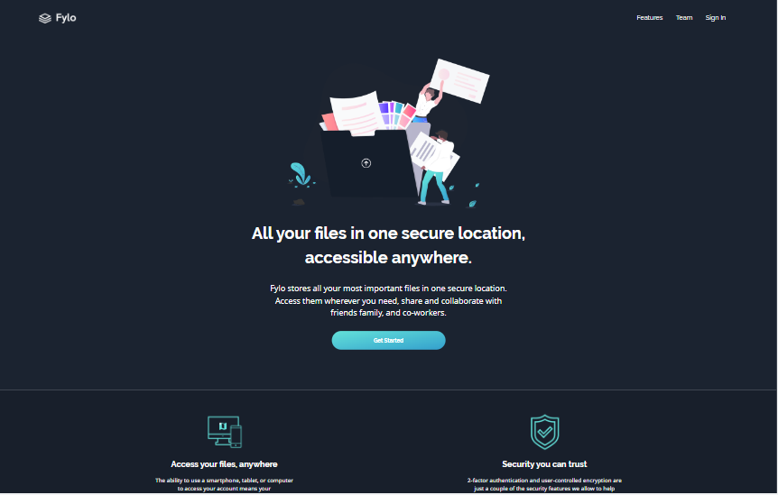
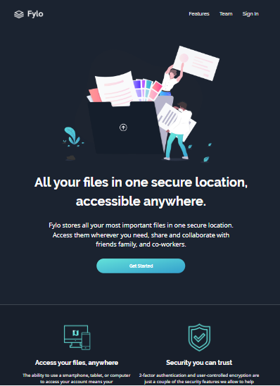
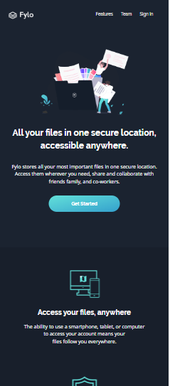

# Frontend Mentor - Fylo dark theme landing page solution

This is a solution to the [Fylo dark theme landing page challenge on Frontend Mentor](https://www.frontendmentor.io/challenges/fylo-dark-theme-landing-page-5ca5f2d21e82137ec91a50fd). Frontend Mentor challenges help you improve your coding skills by building realistic projects. 

## Table of contents

- [Overview](#overview)
  - [The challenge](#the-challenge)
  - [Screenshot](#screenshot)
  - [Links](#links)
  - [Built with](#built-with)
  - [Continued development](#continued-development)
- [Author](#author)

### The challenge

Users should be able to:

- View the optimal layout depending on their device's screen size
- See hover states for interactive elements

### Screenshot

### Links

- Solution URL: (https://fylo-landing-page-saleem-devs.vercel.app/)

### Built with

- Semantic HTML5 markup
- CSS custom properties
- Flexbox
- Desktop-first responsive design

### Continued development

I want to focus on media query and responive design. Also currntly learning JavaScript (tho' I didn'nt use it in this challenge), I'd like to 
focus on learning JavaScript and I'd like to continue with ReactJs after before moving to Backend.

## Author

- Twitter - [@abdsalam_saleem](https://www.twitter.com/abdsalam_saleem)

